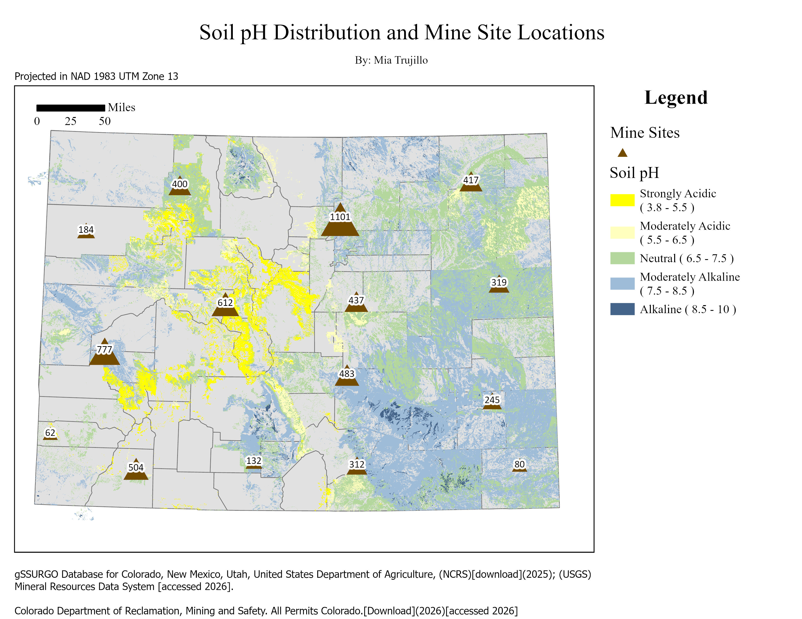
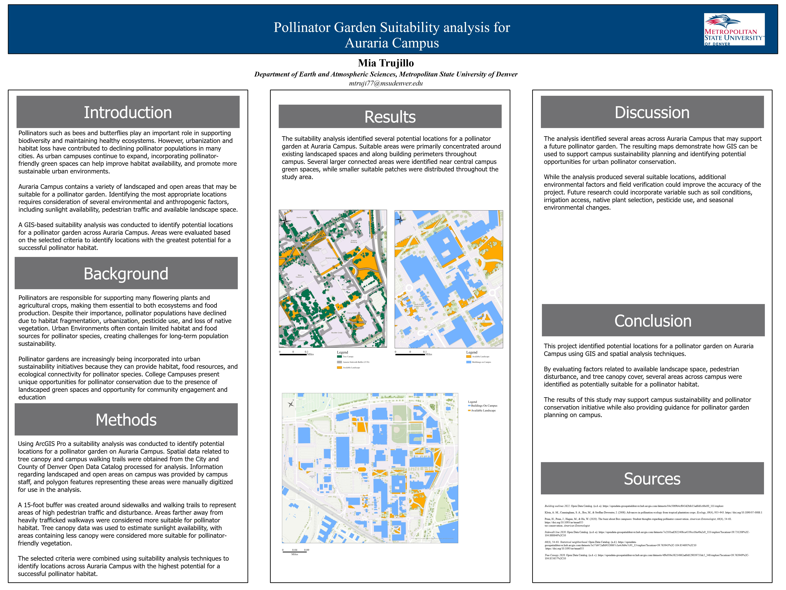

## GIS Portfolio
Maps, spatial analysis, and environmental planning projects.

## Projects

## Skills

- ArcGIS Pro
- Cartography
- Spatial Analysis
- Environmental Research 

### Contact information
* [Email](mtruji77@msudenver.edu)
* [LinkedIn](https://www.linkedin.com/in/mia-trujillo-b759a13b3/)
